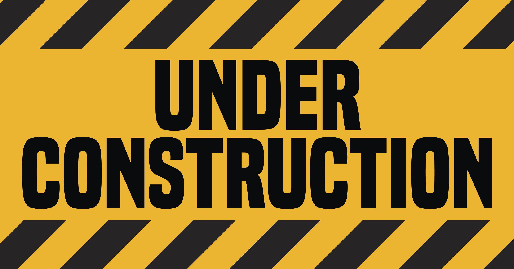

# Commander
Commander is a WIP Command framework to aid in the creation of command line tools.

## TODO
- [ ] Finish Unit tests.
- [ ] Add flag parser.
- [x] Add argument preprocessor for commands ala discordpy ?
      E.g.: myFunc(string arg1, int arg2)
- [ ] Add code comments
- [ ] Add unit tests (aim for 100% coverage)
- [ ] Add code docs
- [ ] Add examples
- [ ] Prettify README.md
- [ ] Add command usage info generation from metadata
- [ ] Add special char parser to Example and Description test
- This all could have gone in a project right?